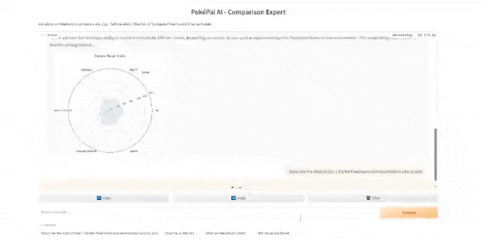

# PokéPal AI - Pokémon Chatbot with Stats Graph

[](https://www.python.org/)
[](https://opensource.org/licenses/MIT)
[](YOUR_GRADIO_SPACE_URL_HERE) <!-- Replace with your actual Gradio Space URL if deployed -->

PokéPal AI is an interactive chatbot that leverages the power of Large Language Models (LLMs) and external APIs to provide detailed information about Pokémon, including visualizing their stats! Ask about a single Pokémon or compare multiple ones.

## Demo


_(This GIF shows an example interaction with the chatbot, comparing Pokémon stats)_

**Try it live:** [PokéPal AI on Gradio Spaces](YOUR_GRADIO_SPACE_URL_HERE) <!-- Replace with your actual Gradio Space URL if deployed -->

## About The Project

This project demonstrates how to integrate OpenAI's API (specifically, the "Tools" or function calling feature) with the public `pokeapi.co` API to fetch real-time data. The chatbot, named PokéPal AI, can understand user queries about specific Pokémon or requests to compare multiple Pokémon.

When a user asks a question, the chatbot uses the OpenAI LLM to identify the Pokémon mentioned in the _most recent_ query and determines the need to fetch data. It then calls a custom tool (`get_pokemon_info`) which sends requests to the PokeAPI for each identified Pokémon. The tool retrieves key information such as types, abilities, base experience, and base stats (HP, Attack, Defense, Sp. Atk, Sp. Def, Speed).

A key feature is the dynamic visualization of stats. The application uses Matplotlib to generate a spider (radar) chart based on the retrieved stats. If multiple Pokémon are successfully retrieved, a comparison graph is generated. If only one is successful, a graph for that single Pokémon is shown. This chart is then encoded into Base64 PNG format and embedded directly within the chatbot's Markdown response, providing an immediate visual representation alongside the textual information.

The user interface is powered by Gradio, offering a simple and accessible web interface for the chat.

## Key Features

- **Conversational Interface:** Simple chat window powered by Gradio.
- **OpenAI Tools Integration:** Intelligently calls external functions (API calls) based on the user's _latest_ query.
- **PokeAPI Data Fetching:** Retrieves up-to-date information for one or multiple Pokémon per request.
- **Dynamic Stats Visualization:** Automatically generates and displays a spider chart for base stats (single or comparison).
- **Image Embedding:** The chart is displayed directly within the chatbot's response using Base64 encoding.
- **Context Awareness:** Designed to focus tool calls only on Pokémon mentioned in the most recent user message, preventing accumulation from conversation history.

## Tech Stack

- Python 3.8+
- OpenAI API (`openai` library)
- PokeAPI (`requests` library)
- Matplotlib (for chart generation)
- NumPy (dependency for Matplotlib)
- Gradio (for the web UI)
- python-dotenv (for managing environment variables)

## Setup and Installation

1.  **Prerequisites:** Ensure you have Python 3.8 or newer installed.
2.  **Clone the Repository:**
    ```bash
    git clone https://github.com/YOUR_USERNAME/pokeapi-gradio-chatbot.git # Replace YOUR_USERNAME and repo name if different
    cd pokeapi-gradio-chatbot
    ```
3.  **Create and Activate a Virtual Environment (Recommended):**
    - **Linux/macOS:**
      ```bash
      python3 -m venv venv
      source venv/bin/activate
      ```
    - **Windows:**
      ```bash
      python -m venv venv
      .\venv\Scripts\activate
      ```
4.  **Install Dependencies:**
    The required packages are listed in `requirements.txt`. Install them using pip:
    ```bash
    pip install -r requirements.txt
    ```
5.  **Configure API Keys:**
    - Create a file named `.env` in the root directory of the project. You can copy `.env.example` if it exists: `cp .env.example .env`
    - Edit the `.env` file and add your OpenAI API key:
      ```dotenv
      OPENAI_API_KEY="sk-..."
      ```
    - **Important:** The `.gitignore` file is configured to prevent committing your `.env` file. **Never commit your API keys directly to Git.**

## Running the Application

1.  **Ensure your virtual environment is activated.**
2.  **Run the Main Python Script:**
    ```bash
    python main.py
    ```
3.  **Access the Interface:**
    Open your web browser and navigate to the local URL provided by Gradio in your terminal (usually `http://127.0.0.1:7860`).

## How It Works

1.  The user enters a query (e.g., "Compare Pikachu and Eevee stats") in the Gradio interface.
2.  The `main.py` script passes the message and history to the `chat` function.
3.  The `chat` function constructs the message list (System Prompt + History + User Message) and sends it to the OpenAI LLM along with the `get_pokemon_info` tool definition.
4.  The LLM analyzes the _latest user message_, identifies the Pokémon names ("Pikachu", "Eevee"), and returns a request to call the `get_pokemon_info` tool with `pokemon_names=["Pikachu", "Eevee"]`.
5.  The `handle_tool_calls` function receives the request and executes the Python `get_pokemon_info` function.
6.  `get_pokemon_info` loops through the names, calls the PokeAPI for each, extracts data (including stats), and returns a dictionary like `{"Pikachu": {...data...}, "Eevee": {...data...}}`.
7.  The `chat` function processes the tool results, filtering for successful responses containing stats.
8.  If one or more successful results with stats are found, `create_comparison_spider_chart` is called to generate the Base64 PNG image of the graph.
9.  The raw tool results (JSON string of the data dictionary) are added to the message list, and a second call is made to the OpenAI LLM.
10. The LLM, now having the context of the query and the fetched data, generates a final textual response comparing the Pokémon.
11. The `chat` function appends the Base64 image (as Markdown) to the LLM's text response if a graph was generated.
12. The combined response (text + embedded image) is displayed to the user in the Gradio interface.

**Developed by [Tomislav Sertić](https://tsertic.dev)**
